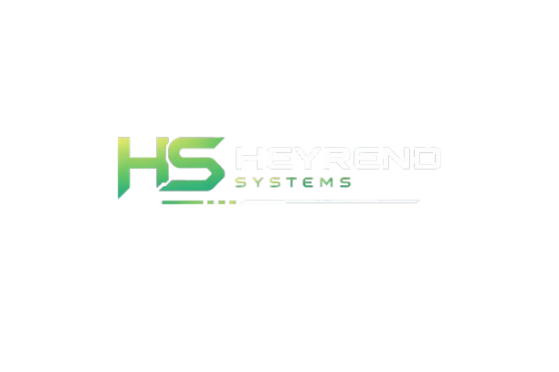

<p align="center">
  
</p>

---

```bash

┌───────────────────────────────────────────────┐
│              HeyrendSystems@github            │
└───────────────────────────────────────────────┘

$ whoami
Jacob Heyrend

$ echo "Engineering • Software • Technical Systems"
Engineering • Software • Technical Systems

$ about
Personal portfolio for software projects, simulations,
technical tools, and system-focused builds.

$ background
8 Years — Directional Drilling Operations
5 Years  — Water Distribution & Treatment Systems

Experience working with real-world infrastructure,
mechanical systems, safety procedures, and
large-scale operational environments.

$ education
B.S. Computer Science — WGU (In Progress)

$ goal
Connect code with real-world applications and
build clean, functional systems.

$ tree focus/
focus
├── software-development
├── simulations
├── technical-tools
├── networking
└── automation

$ tech_stack
Languages  : Python, JavaScript, SQL
Tools      : Git, GitHub, VS Code
Systems    : MQTT, Modbus, Node-RED
Interests  : Instrumentation, Control Logic, Dashboards

$ ls featured_projects/
digital-well-house-simulator
virtual-plc-engine
modbus-device-tester

$ contact --info
GitHub   : https://github.com/HeyrendSystems
LinkedIn : (coming soon)
Email    : (optional)
```

